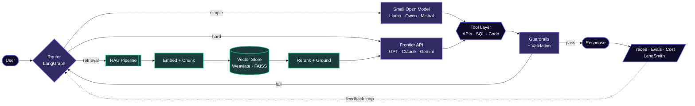

<div align="center">


<p>
  <a href="https://www.linkedin.com/in/abhishek-singh-kushwaha"></a>
  <a href="mailto:abhisheksinghs.1031@gmail.com"></a>
  <a href="https://github.com/AbhishekSinghKushwaha"></a>
</p>

<p>
  
  
  
  
</p>

</div>

---

## 👋 About Me

I'm an **AI Software Engineer** with **6 years of experience** building full-stack applications and production-grade AI systems. I design **agentic workflows**, **RAG pipelines**, and **LLM-powered products** using Python, LangChain, LangGraph, and FastAPI, running on frontier APIs and open-weight models alike, deployed across AWS and Google Cloud.

My path runs from **data science** → **three years of full-stack engineering** shipping production apps for users across the US and Africa → **graduate AI research** on deep learning for Alzheimer's detection and biometric authentication. That arc means I think about AI systems from both the research bench and the production floor. I know what it costs when systems fail at scale.

```console
$ whoami --verbose

  role      →  AI Software Engineer @ Srasks
  focus     →  Agentic Workflows · RAG · LLM Systems · Cloud AI
  models    →  GPT · Claude · Gemini · Llama · Mistral · Qwen · DeepSeek
  runtime   →  Ollama · Groq · Docker · Kubernetes · AWS · GCP
  daily     →  Claude Code · Codex · OpenCode · Antigravity
  open_to   →  Senior AI Engineer · Applied AI Engineer · AI/ML Engineer
  motto     →  "Make it correct, then make it cheap, then make it fast."

$ _
```

---

## 🧬 How I Build Agentic Systems

> The shape almost every system I ship converges on: routed, grounded, evaluated, and cheap by default.



---

## 🛠️ Tech Stack

<details open>
<summary><b>🧠 Models & Inference</b></summary>
<br>
<p>


</p>
</details>

<details open>
<summary><b>🤖 AI Coding Agents</b></summary>
<br>
<p>


</p>
</details>

<details open>
<summary><b>🔗 AI / ML Frameworks</b></summary>
<br>
<p>


</p>
</details>

<details open>
<summary><b>💻 Languages, Backend & Web</b></summary>
<br>

<br><br>

</details>

<details open>
<summary><b>🗄️ Data, Vector & Cloud</b></summary>
<br>
<p>


</p>
<p>


</p>
</details>

---

## 🔭 Currently

```text
▸ Building     multi-agent workflows with LangGraph + MCP tool servers
▸ Exploring    open-weight model routing with Ollama and Groq
▸ Learning     eval-driven development & LLM observability at scale
▸ Ask me about RAG that survives contact with real documents
```

<div align="center">

*Building at the intersection of agentic AI, retrieval systems, and production infrastructure.*

</div>


